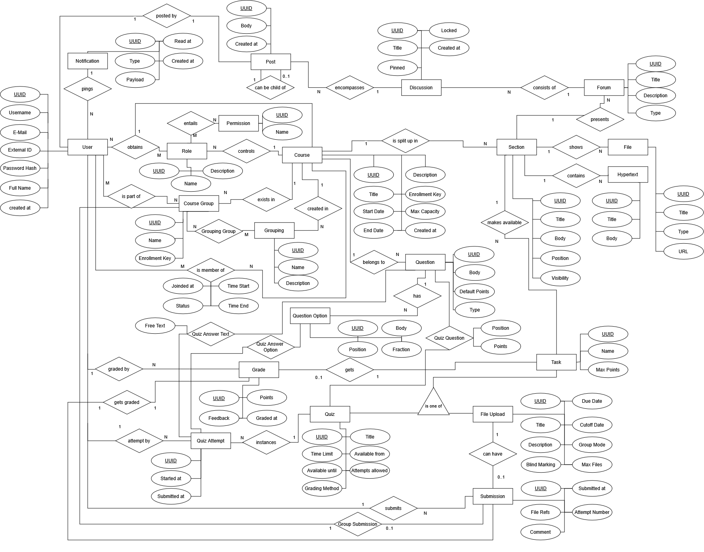

# dashboard-rs

Dashboard for the DBS I project: PostgreSQL, Rust (axum, sqlx, maud), server-rendered HTML with SVG charts.

- `migrations/20260920000000_initial_schema.sql`: tables, views, triggers, indexes
- `src/main.rs`, `src/routes.rs`: main entry point and plumbing
- `src/db/`: the DAL with all the SQL queries. Apart from tests, only read-only queries are in here. Queries are colocated by their main 'topic'
- `src/db/tests.rs`: functional tests against a DB in rolled-back transactions (does the DB refuse illogical data, do the queries handle edge-cases properly)
- `src/views/`: HTML rendering
- `seeds/seed_large.sql`: demo data generated by `seeds/gen_seed.py`
- `seeds/seed.sql`: small fixture for the tests

## Run

Needs a Rust toolchain (edition 2024), a running PostgreSQL server, `psql`, sqlx-cli
(`cargo install sqlx-cli --no-default-features --features postgres`), and `just`.

```sh
just setup
just run
```

`setup` creates the database, applies the schema, and loads the demo data. The app then runs
at http://127.0.0.1:3000. The database defaults to `moodle` over the local socket as the
current user; set `DATABASE_URL` to override. Use `just reset` to drop and recreate the DB,
should it corrupt somehow.

## Test

```sh
just test
```

Runs the unit tests, then the query tests. The query tests use the same database as the
app but leave it as it was: each test creates a dedicated namespace, initializes fresh tables
from the schema and seeds then, then runs its queries in one big rolled back transaction.
Other recipes: `prepare` refreshes the compile-time query metadata after changing a
query, `fmt` formats Rust and SQL (needs sqlfluff), `lint` runs clippy, `seed`
regenerates the demo data. The justfile shows the commands behind each recipe.

## Semantics

- The missing-submissions list names the active course members with role `Studierende` who have not submitted, neither themselves nor through their group.
- Group assignments accept submissions by the student's current group within the assignment's grouping.
  Such a submission and its grade belong to every member of that group: on the student page and
  in the missing-submissions list.
  - The most-active-members table on the course page is the exception to this: it counts the submissions
    a student uploaded personally and averages the grades of those, so a group upload is
    attributed to its uploader only.
- Quiz statistics use submitted attempts only; attempts still in progress are ignored.
  An attempt submitted without any answer scores 0 and is included in the average.
- The average in the quiz table is per attempt, not per student, meaning a student can factor in more than once.
- Selection questions score themselves from `question_option.fraction`; a free-text answer
  scores what a marker awarded it in `grade`, which references either a submission or one
  answer. An unmarked answer has no grade row and counts as zero (the quiz table shows how
  many are still open like this)
- Rankings apply the quiz's `grading_method` (highest, average, first or last attempt) and
  use competition ranks (1, 1, 3).
- The dashboard is read-only and has no login. Roles and permissions are in the schema but
  nothing enforces them.

# ER Diagram



# AI Disclosure

The seed data generation script (`seeds/gen_seed.py`) and the CSS styling (`static/app.css`) were generated by Claude Opus 5.
